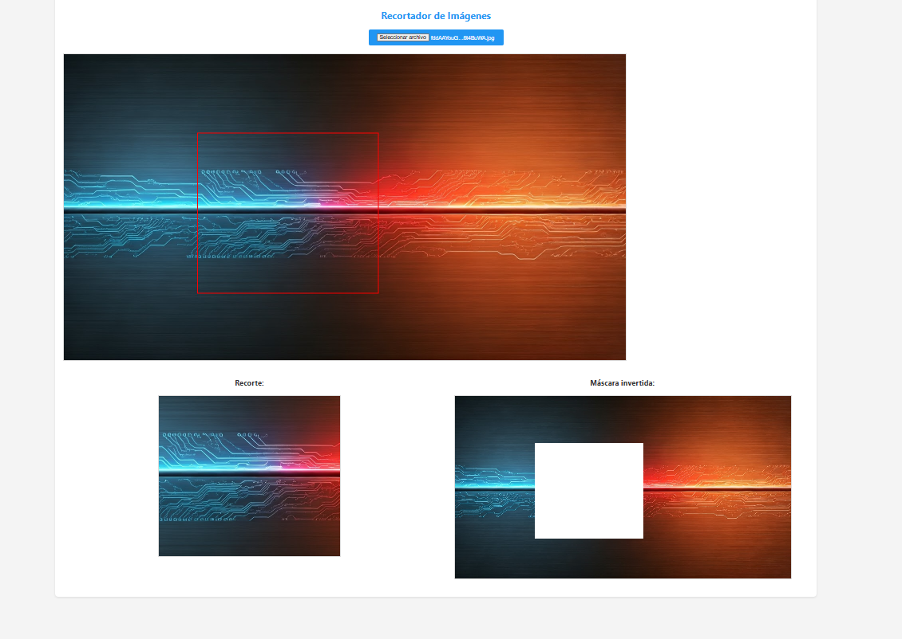

# Recortador de Imágenes
Un proyecto de recortador de imágenes con funcionalidad de selección de área y creación de máscara invertida.

## Funcionalidades
- Carga de imágenes
- Selección de área para recortar
- Visualización del recorte
- Creación de máscara invertida

## Tecnologías
- HTML
- CSS
- JavaScript
- Canvas API

## Uso
1. Selecciona una imagen para cargar.
2. Haz clic y arrastra el mouse para seleccionar el área a recortar.
3. La imagen recortada y la máscara invertida se mostrarán en la pantalla.
